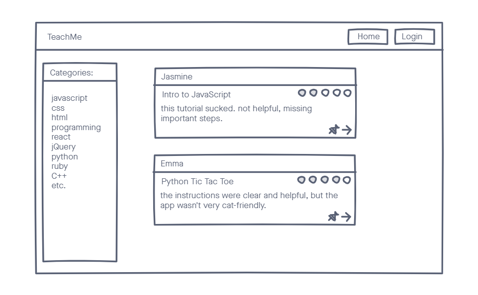
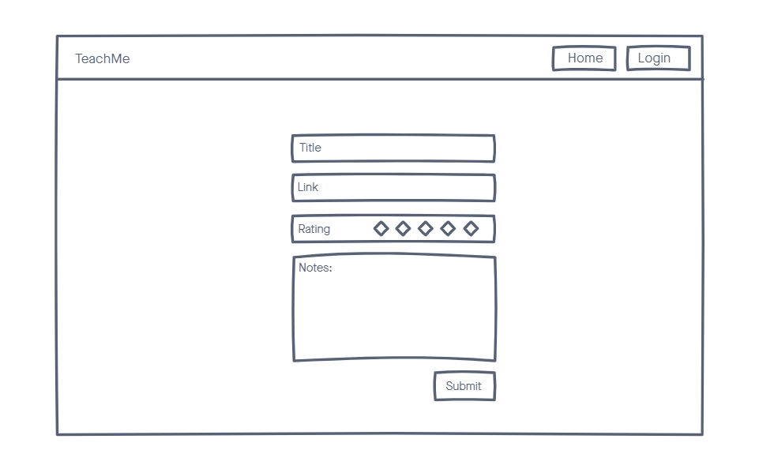
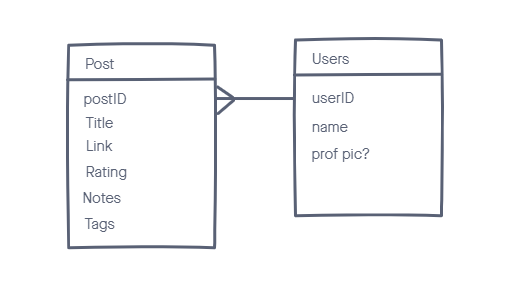

# Stacks
A web app for saving, sharing, and exploring online resources and tutorials.

## Technologies
- React
- JavaScript
- MongoDB
- Mongoose
- Express

## Screenshots

## Getting Started
[Click here](https://teachme-resource-app.herokuapp.com/) to get started. Login with Google and start adding and browsing resources!

## Future Enhancements
- Add ability to make a resource private
- Add ability to "save" other users' resources.